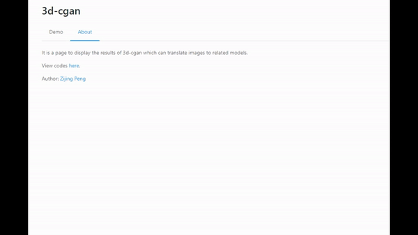
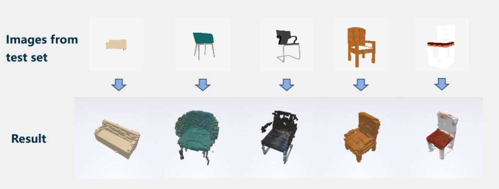
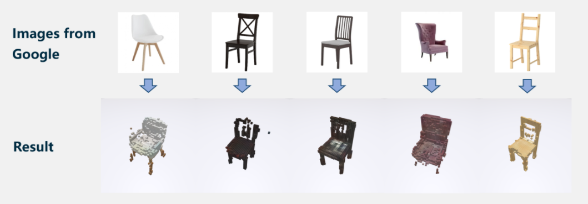

# 3d-cgan

A neural network based on Conditional GAN which can translated image to colored model.

------

I implemented a system to show the results by React and Three.js. (The codes are not included in this file)







### Getting started

```
git clone https://github.com/ZijingPeng/3d-cgan.git
```

### Datasets

I downloaded the datasets from [im2avatar](https://github.com/syb7573330/im2avatar) and [3D-R2N2](https://github.com/chrischoy/3D-R2N2) ,  and made some revise (see details in `prepare_dataset.py`). 

**You can just download the dataset I prepared:**

- ShapeNetCore_im2avatar: https://drive.google.com/open?id=1swd-K0iBFK08LfOWo3MF_63YGZ22-xwc

### Checkpoints

Download pretrained checkpoints [here](https://drive.google.com/open?id=1Nf3ymgnrX7Y8DLdTZAfG1DiqoZ9b_3Qt).

### How to run

Download checkpoints and copy to `ckp`  folder, download datasets to `ShapeNetCore_im2avatar` folder.

Then run the `test.py` to generate models or run `train.py` to train.

When you are testing images downloaded online, you had better use `cv2.dilate` or similar function to preprocess the images, in order to exclude light influences.  (see comments in  `test.py` )

### License

MIT License


